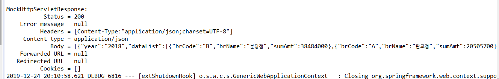
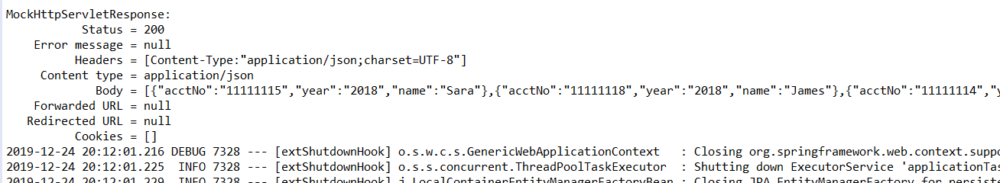
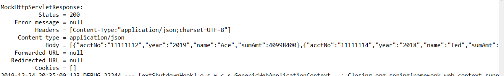
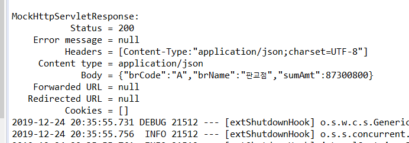

# [CUSTOMER TRANSACTION API] _과제전형
## 스프링 부트를 활용하여 주어진 4개의 API를 개발한다.
-------------------------------------------------
### 개발환경
  - Spring boot 2.2.2, Spring Data JPA
  - JDK1.8, MySql
  - lombok
  - 빌드환경 및 실행 : gradle, Junit5  
  
-------------------------------------------------------------------------------------------------------------------

### 과제 수행 방법
  - API개발은 기본적으로 RestController를 get방식으로 호출하였으며 Service의 대한 결과 데이터를 JSON으로 리턴함.
  - 쿼리의 경우 Spring Data JPA의 **@Query, Native Query, JPA Repository**에서 사용하는 기본 함수를 적절히 조합하여 데이터를 추출한다.
    **(Group By, partition by 를 이용하는 쿼리의 경우 @Query를 이용한 native Query를 이용한다)**
  - 추출한 데이터를 **for, if, List<Map<String,Object>>, List<Object>** 등을 적절히 이용하여 JSON값을 리턴한다.
  - Input이 있는 API는 @RequestBody Map<String, String> params 를 이용하여 JSON값을 입력받는다.
	
--------------------------------------------------------------------------------------------------------------
	
### Spring Data JPA를 활용한 엔티티 정의
#### 과제에서 주어진 데이터를 가지고 엔티티의 관계를 유추하여 *Spring Data JPA 엔티티*를 구성하였다.
- 지점 엔티티는 계좌정보와 *1:1의 연관관계*를 가진다(계좌하나는 지점하나에서 관리한다)
- 계좌 엔티티는 거래정보와 *1:N의 연관관계*를 가진다(계좌하나에 대해 여러 거래내역이 존재한다)
- 계좌 엔티티와 거래정보는 *식별관계*를 가진다(계좌 엔티티의 PK가 거래정보 엔티티의 복합키의 일부 칼럼으로 존재한다)  
 

--------------------------------------------------------------------------------------------------------------
### 4가지 API 해결 방법
#### A. 2018년, 2019년 각 연도별 합계 금액이 가장 많은 고객을 추출하는 API 개발.(단, 취소여부가 ‘Y’ 거래는 취소된 거래임, 합계 금액은 거래금액에서 수수료를 차감한 금액임)
**/maxCustomerByYear 호출**
1. @Query를 활용한 native 쿼리로 API를 구현했다.

	SELECT  year, acctNo, sumAmt, account.accountname as name  
	FROM  
		(  
			select substring(transactiondate,1,4) as year, accountnumber as acctNo, sum(cost-fees) as maxcost,   					MAX(sum(cost-fees)) OVER(PARTITION BY substring(transactiondate,1,4)) AS sumAmt  
			from transaction.transaction  
			where transaction.iscancel = 'N'   
			group by substring(transactiondate,1,4), accountnumber   
		) T, transaction.account  
	WHERE   T.maxcost = T.sumAmt  
			and account.accountnumber = T.acctNo  	

2. *(1.)* 쿼리의 추출결과로 API 리턴 값을 만들었다.

#### B.2018년 또는 2019년에 거래가 없는 고객을 추출하는 API 개발.
(취소여부가 ‘Y’ 거래는 취소된 거래임)
- 거래가 없는 고객 : 계좌 - 각 년도의 거래내역에 있는 계좌(취소여부가 N인계좌)를 이용
**/emptyTransactionCustomerByYear 호출**

1. 거래내역에 존재하는 년도를 가져온다
2. JPA를 이용하여 (취소여부가 N인경우와 1)의 해당하는 연도를 기준의 거래정보에서 중복되지 않는 계좌번호를 가져온다
3. 계좌정보의 계좌번호와 일치하는 2)의 계좌정보를 찾는다.
4. 계좌정보에서 거래내역이 있는 계좌를 제거하면 각 연도의 거래내역이 없는 고객을 추출할 수 있다.
   
#### C.연도별 관리점별 거래금액 합계를 구하고 합계금액이 큰 순서로 출력하는 API 개발.( 취소여부가 ‘Y’ 거래는 취소된 거래임)
**/BranchTransactionByYear 호출**

1. 거래내역에 존재하는 년도를 가져온다
2. @Query를 활용한 native Query로 한 해의 지점별 거래금액 합계를 추출한다.

select substring(transactiondate,1,4) as year, branch.branchcode as brCode  
  		, branch.branchname as brname, sum(cost-fees) as sumAmt  
from transaction, account, branch  
where transaction.accountnumber = account.accountnumber and branch.branchcode = account.branchcode  
		and transaction.iscancel='N' and substring(transactiondate,1,4) = **:year**  
group by substring(transactiondate,1,4), branch.branchcode  
order by substring(transactiondate,1,4) asc , sum(cost-fees) desc  

3. 위 쿼리로 추출된 데이터를 년도 기준으로 리턴하는 JSON을 구성한다.
   
#### D.분당점과 판교점을 통폐합하여 판교점으로 관리점 이관을 하였습니다. 지점명을 입력하면 해당지점의 거래금액 합계를 출력하는 API 개발( 취소여부가 ‘Y’ 거래는 취소된 거래임,)
**/TransactionCostByBranch 호출**

1. 지점이름을 JSON형태로 입력받는다.
2. JPA를 활용하여 입력한 지점명의 Branch클래스를 가져온다(Branch가 미존재시 HTTP Status 404와 주어진 메시지를 전달한다.)

*throw new ResponseStatusException(  
	HttpStatus.NOT_FOUND, "br code not found error"  
);*

위 코드를 활용하여 Branch가 null일 때 예외처리를 수행함.

3. Branch정보로 해당 지점에 속한 계좌를 조회한다(지점과 계좌가 1:1관계로 Class를 지니고 있으므로 JPA활용이 가능하다)
4. *(3.)*에서 조회환 계좌정보를 가지고 거래정보(취소여부:N)인 경우의 합을 구한뒤 API에서 요구하는 JSON형태로 값을 리턴한다.

----------------------------------------------------------------------------------------------------

### UNIT TEST 수행
#### mockMvc를 각 API 컨트롤러를 호출하는 UNIT TEST(Junit5)를 수행하여 정상 결과가 나옴을 확인함.
- BranchTransactionByYearTEST.java 연도별 거래금액이 높은 순의 지점

- EmptyTransactionCustomerByYearTest.java : 연도별 거래내역이 없는 고객

- MaxCustomerByYearTest.java : 연도별 거래금액이 큰 고객

- TransactionCostByBranchTest.java 지점 기준 거래금액

